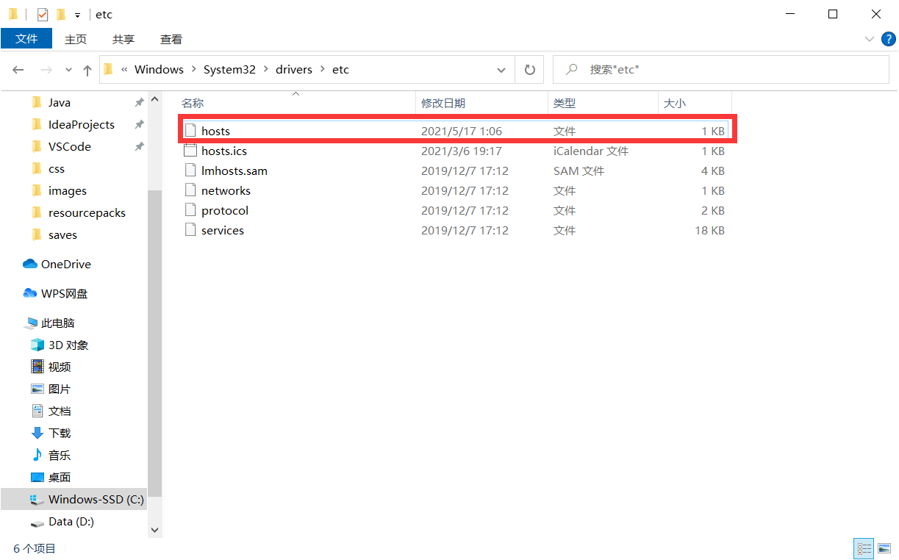

##  Github访问过慢问题

解决方式：

1.打开网址：http://tool.chinaz.com/dns

找到延迟最低节点

2.打开本地文件：C:\Windows\System32\drivers\etc

3.在文件尾添加

13.229.188.59 github.com git
116.89.243.8 github.global.ssl.fastly.net

# IDEA的Git

## 一、创建本地仓库

IDEA便会自动生成了.git的隐藏文件夹

