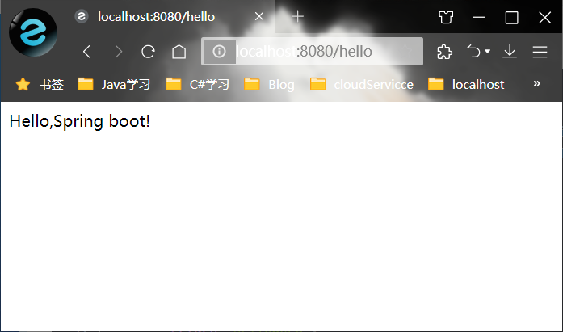

# 项目架构

```bat
main
 ├────java----主代码目录
 		├────com.may----项目目录
                ├────constant----常量配置层
 				├────controller----控制层
 				├────dao----数据访问层(mapper):数据库持久化操作
 				├────dto----数据传输层
 				├────exception----错误信息层
 				├────interceptor----拦截器
 				├────log----日志文件
 				├────model----数据模型层(entity、domain):存放映射到数据库的实体类
 				├────service----服务层
 						└────impl----接口层
 				├────view----视图层
                └────com.may-utils----工具层
 └────resources----资源目录
 		├────i18n----国际化
 		├────static----静态文件
        		├────css
                ├────images
                ├────js
                └────lib
 		├────templates----网页模板
        		├────admin----后台管理
                ├────blog----前端页面
                ├────commons----通用模板
                └────error----错误页面
 		├────application.yaml----环境配置文件
 		├────application-dev.yaml----开发环境
 		├────application-prod.yaml----生产环境
 		├────application-test.yaml----测试环境
 		└────banner.txt
```

# 数据库设计

```bat
blog
 ├────userinfo----用户表
```

## 用户表(`userinfo`)

```bat
userinfo----用户表
 ├────id ----主键|自增|bigint----用户编号
 ├────account ----varchar(50)----用户账号
 ├────password ----varchar(100)----用户密码
 ├────nickname ----varchar(50)----用户昵称
 ├────email ----varchar(50)----用户邮箱
 ├────telephone ----int(11)----用户手机号码
 ├────avatar ----varchar(100)----用户头像
 ├────gender ----tinyint(1)----用户性别:0-保密;1-男;2-女
 ├────account_balance ----bigint----账户余额
 ├────status ----tinyint(1)----账号状态:0-正常;1-限制;2-封禁
 ├────permission ----tinyint(1)----用户权限:0-管理员;1-VIP用户;2-普通用户
 ├────create_time ----datetime----注册时间
 └────update_time ----datetime----最新信息修改时间
```


# 常用注解

## 简单控制器

```java
@RestController
public class HellController {
    @RequestMapping("/hello")
    public String hello(){
        return "Hello,Spring boot!";
    }
}
```

`@Controller`:声明为控制器

`@RestController`:声明为返回字符串的控制器

`@RequestMapping`:配置URL和方法之间的映射

访问结果：



## 视图控制器

```java
@Configuration
public class WebViewConfigurer implements WebMvcConfigurer {
    @Override
    public void addViewControllers(ViewControllerRegistry registry) {
        WebMvcConfigurer.super.addViewControllers(registry);
        /*登录页*/
        registry.addViewController("/index.html").setViewName("admin/index");
        /*注册页*/
        registry.addViewController("/register.html").setViewName("admin/register");
    }
}
```

1. 使用`@Configuration`注解声明为**配置类**。
2. 继承`WebMvcConfigurer`并重写`addViewControllers`方法。
3. 使用语法
   `registry.addViewController("[输入地址]").setViewName("[读取页面相对地址]");`

## 数据库表映射实体类

```java
@Entity
@Table(name = "userinfo")
public class UserInfo {
    @Id
    @GeneratedValue(strategy = GenerationType.IDENTITY)
    private BigInteger id;
    private String account;
    @Temporal(TemporalType.TIMESTAMP)
    private Date create_time;
    
    public UserInfo() {}
    
    public BigInteger getId() { return id; }
    public void setId(BigInteger id) { this.id = id; }
    public String getAccount() { return account; }
    public void setAccount(String account) { this.account = account; }
    public Date getCreate_time() { return create_time; }
    public void setCreate_time(Date create_time) { this.create_time = create_time; }
    @Override
    public String toString() {
        return "UserInfo{" +
                "id=" + id +
                ", account='" + account + '\'' +
                ", create_time=" + create_time +
                '}';
    }
}
```

1. `@Entity`声明为实体类。
2. `@Table(name = "userinfo")` 声明为表类型，表名为`userinfo`。
3. `@Id` 声明为主键
4. `@GeneratedValue(strategy = GenerationType.IDENTITY)`声明为自增。
5. `@Temporal(TemporalType.TIMESTAMP)` 设置数据库表里生成时间的类型：这里选择为全时间格式。
6. 创建一个空的构造器。
7. 生成访问器和设置器。
8. 重写`toString`方法。
